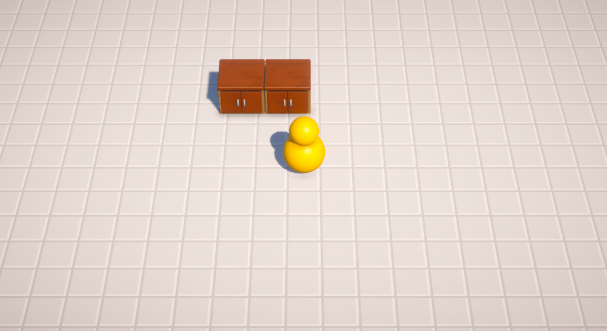
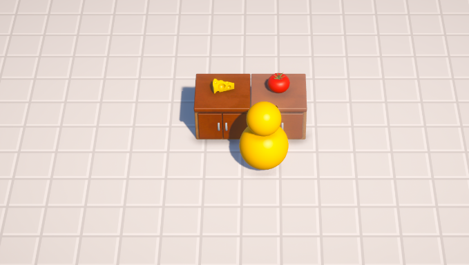
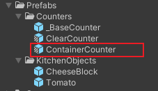
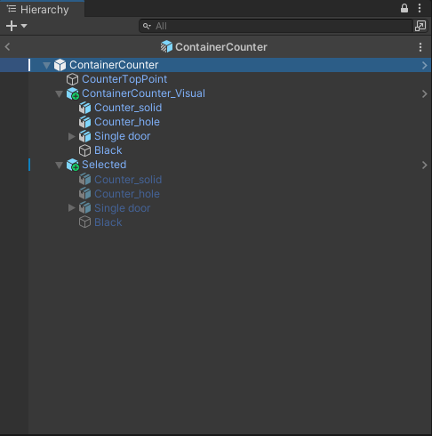
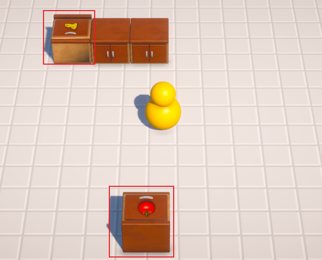
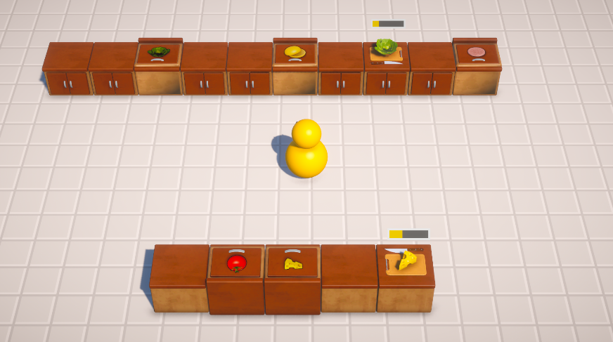
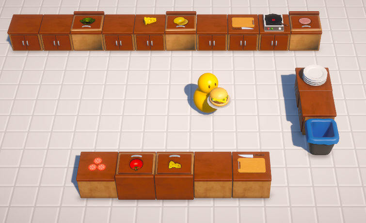

# Kitchen Chaos 开发笔记

### 0.开发环境

unity版本: 2022.2.2f1c1

3dURP项目

初始化项目结构

减少渲染平台的等级，删除相关urp配置文件

完成制作后改成msaa 超采样抗锯齿方法

### 使用cinemachine

### 使用新输入系统

当前效果

交互生成物品

新增容器柜台

### 切菜柜台、切菜进度及效果

### 煎炸柜台、垃圾桶、盘子柜台

使用继承制作 盘子物品

使用结构体完成汉堡原料表

使用接口完成进度条UI展示

